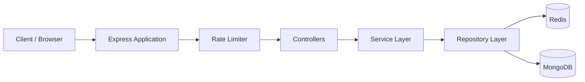

# 🔗 URLShortener

<div align="center">


A production-ready URL Shortener built with **Node.js**, **Express**, **MongoDB**, **Redis**, and **Docker**, following a layered architecture with Repository-Service pattern, Redis caching, rate limiting, validation, structured logging, and complete API documentation.

</div>

---

# Table of Contents

- Project Overview
- Features
- Tech Stack
- High Level Architecture
- System Design
- Request Lifecycle
- Data Flow
- Redis Cache Flow
- Project Philosophy

---

# Project Overview

This project is designed to simulate how modern backend systems are developed in production environments.

Unlike traditional CRUD applications, the architecture separates concerns into independent layers including Controllers, Services, Repositories, Models, Validators, Middleware, Utilities, and Configuration modules.

The objective is not only to shorten URLs but also to demonstrate scalable backend engineering practices such as:

- Clean Architecture
- Separation of Concerns
- Repository Pattern
- Service Layer
- Redis Caching
- Rate Limiting
- Centralized Error Handling
- Structured Logging
- Dockerized Deployment
- API Documentation

Every request travels through multiple well-defined layers before reaching the database, making the application easier to extend, debug, maintain, and test.

---

# Features

## URL Management

- Create Short URLs
- Redirect using Short Code
- Retrieve URL Information
- Expiration Support
- Duplicate URL Handling

---

## Performance

- Redis Cache
- MongoDB Persistence
- Fast URL Lookup
- Optimized Database Queries
- Lightweight Responses

---

## Reliability

- Global Error Handler
- Request Validation
- Structured Logging
- Production Configuration
- Graceful Error Responses

---

## Security

- Request Rate Limiting
- Advanced Rate Limiting
- Input Validation
- URL Sanitization
- HTTP Security Best Practices

---

## Developer Experience

- Swagger Documentation
- Docker Compose
- Environment Configuration
- ESLint
- Prettier
- Unit Testing
- Performance Testing

---

# Tech Stack

| Layer | Technology |
|----------|----------------|
| Runtime | Node.js |
| Framework | Express.js |
| Database | MongoDB |
| ODM | Mongoose |
| Cache | Redis |
| Validation | Joi |
| Logging | Winston |
| Documentation | Swagger |
| Containers | Docker |
| Orchestration | Docker Compose |
| Testing | Jest |
| Linting | ESLint |
| Formatting | Prettier |

---

# High Level Architecture

```

                        Client
                           │
                    HTTP Request
                           │
                    Express Router
                           │
                    Validation Layer
                           │
                 Rate Limiting Layer
                           │
                     Controller Layer
                           │
                      Service Layer
                           │
                 Repository Pattern
                  │               │
                  │               │
             Redis Cache      MongoDB
                  │               │
                  └──────┬────────┘
                         │
                  Business Result
                         │
                 Response Formatter
                         │
                    HTTP Response

```
# Current Deployment Architecture



The current deployment is ideal for:

- Local development
- Learning backend architecture
- Small production deployments
- Personal projects
- MVP applications

---

# Current Request Flow

Every request follows the following path:

```

Client

↓

Express Server

↓

Validation Middleware

↓

Rate Limiter

↓

Controller

↓

Service

↓

Repository

↓

Redis Cache

↓

MongoDB

↓

JSON Response

```

The architecture intentionally separates business logic from infrastructure logic, making it easy to introduce additional services in the future.

---

# Production Scalable Architecture

Although the current implementation runs as a single application, the codebase is intentionally structured so it can evolve into a distributed system.

```mermaid
flowchart LR

Client

↓

DNS

↓

Load Balancer

↓

Node 1

↓

Redis

↓

MongoDB

Load Balancer --> Node2

Load Balancer --> Node3

Node2 --> Redis

Node3 --> Redis

Redis --> MongoDB
```

# Future Production Architecture

As traffic increases, additional infrastructure components can be introduced without significant changes to the application's internal code.

```mermaid
flowchart LR

Client

↓

DNS

↓

CDN

↓

Nginx

↓

Load Balancer

↓

API Server 1

↓

Redis Cluster

↓

MongoDB Replica Set

Load Balancer --> API Server 2

Load Balancer --> API Server 3

API Server 2 --> Redis Cluster

API Server 3 --> Redis Cluster

Redis Cluster --> MongoDB Replica Set

API Server 1 --> Logging

API Server 2 --> Logging

API Server 3 --> Logging

Logging --> Grafana

Logging --> Prometheus
```

---

# Component Responsibilities

| Component | Responsibility |
|------------|----------------|
| Client | Sends HTTP requests to the API |
| Load Balancer | Distributes traffic across multiple application instances |
| Express Application | Handles incoming requests |
| Validation Middleware | Validates incoming payloads |
| Rate Limiter | Prevents abuse and request flooding |
| Controller | Handles HTTP-specific logic |
| Service Layer | Executes business rules |
| Repository Layer | Performs database operations |
| Redis | High-speed caching layer |
| MongoDB | Persistent storage |
| Winston | Structured logging |
| Docker | Containerization |
| Docker Compose | Local orchestration |

---

# Scalability Strategy

The project is designed so each layer can scale independently.

- Multiple Node.js instances can be added behind a load balancer.
- Redis can evolve into a Redis Cluster.
- MongoDB can be upgraded to a Replica Set or Sharded Cluster.
- Background workers can be introduced for analytics and cleanup jobs.
- Reverse proxies such as Nginx can provide SSL termination, compression, and request routing.
- Monitoring systems such as Prometheus and Grafana can be integrated for observability.

Because the business logic is isolated from infrastructure concerns, these upgrades require minimal modifications to the existing codebase.

---

# Why Layered Architecture?

Instead of placing everything inside route handlers, responsibilities are divided.

For example:

**Routes**

Only map endpoints.

Example:

```

POST /api/url

```

Routes never contain business logic.

---

**Controllers**

Controllers understand HTTP.

They receive requests and send responses.

Responsibilities:

- Read request body
- Read params
- Call Services
- Return Response

Controllers never communicate with MongoDB directly.

---

**Services**

Services contain the actual business logic.

Examples:

- Generate Short Code
- Check Cache
- Handle Duplicate URLs
- Manage Expiration
- Apply Business Rules

Services know nothing about Express.

---

**Repositories**

Repositories are the only layer allowed to communicate with MongoDB.

Benefits:

- Database logic stays isolated.
- Easy migration to another database.
- Easier testing using mocked repositories.

---

# Complete Request Lifecycle

Suppose the client sends

```

POST /api/url

```

The request travels like this:

```

Client

↓

Express

↓

Routes

↓

Validation Middleware

↓

Rate Limiter

↓

Controller

↓

Service

↓

Repository

↓

MongoDB

↓

Repository

↓

Service

↓

Controller

↓

Response Utility

↓

Client

```

Every layer has exactly one responsibility.

---

# Detailed Request Flow

## Step 1

Client sends

```

POST /api/url

```

↓

## Step 2

Express receives the request.

↓

## Step 3

The request is matched with

```

routes/url.routes.js

```

↓

## Step 4

Validation middleware validates the payload using Joi.

Invalid payloads never reach controllers.

↓

## Step 5

Rate limiter checks whether the client exceeded limits.

↓

## Step 6

Controller receives a validated request.

↓

## Step 7

Controller delegates work to the Service Layer.

↓

## Step 8

Service checks Redis.

If URL exists:

```

Return cached response

```

Else

↓

Generate short code

↓

Call Repository

↓

Save MongoDB

↓

Store Redis Cache

↓

Return response

↓

Controller

↓

JSON Response

---

# Data Flow

```

Browser

↓

Express

↓

Router

↓

Middleware

↓

Controller

↓

Service

↓

Repository

↓

MongoDB

↓

Repository

↓

Service

↓

Redis Cache

↓

Controller

↓

Client

```

Notice that Controllers never know how MongoDB works.

Similarly, MongoDB never knows anything about HTTP requests.

This separation keeps the architecture clean.

---

# Cache Flow

Redis significantly reduces database load.

```

Incoming Request

↓

Check Redis

↓

Cache Hit?

      YES
       │
       ▼

Return Cached Data

       │
       ▼

Complete Request

```

If cache misses:

```

Redis Miss

↓

MongoDB Query

↓

Store Result in Redis

↓

Return Response

```

This approach reduces response latency and minimizes unnecessary database reads.

---

# Logging Flow

Every request is logged using Winston.

```

Incoming Request

↓

Logger

↓

Business Layer

↓

Database

↓

Logger

↓

Response

↓

Log File

```

Logs help in:

- Debugging
- Monitoring
- Production Troubleshooting
- Performance Analysis

---

# Error Handling Flow

Instead of manually handling errors everywhere:

```

throw Error()

↓

Global Error Handler

↓

Standard Response

↓

Client

```

Every error follows the same response format, improving consistency across the API.

---

# Project Philosophy

This repository is intentionally designed to resemble backend services used in production environments rather than a basic CRUD application.

The emphasis is on clean code organization, maintainability, scalability, and separation of concerns. By isolating routing, validation, business logic, persistence, caching, and error handling into dedicated layers, the project becomes significantly easier to extend and maintain as new features are introduced.

Whether you're exploring backend architecture, preparing for technical interviews, or looking for a reference implementation of a modern Node.js service, this project aims to provide a practical example of production-oriented backend engineering.

## 📁 Project Structure

```
.
├── docker-compose.yml
├── Dockerfile
├── .dockerignore
├── .env
├── .env.example
├── eslint.config.js
├── .eslintrc.json
├── .gitignore
├── LICENSE
├── MakeFile
├── mongo-init.js
├── package.json
├── package-lock.json
├── README.md
├── src
│   ├── app.js
│   ├── server.js
│   ├── config/
│   ├── constants/
│   ├── controllers/
│   ├── docs/
│   ├── middlewares/
│   ├── models/
│   ├── public/
│   ├── repositories/
│   ├── routes/
│   ├── scripts/
│   ├── services/
│   ├── tests/
│   ├── utils/
│   └── validators/
```

---

# Repository Organization

The repository follows a modular architecture where every folder owns a single responsibility. This design minimizes coupling, improves maintainability, and allows features to evolve independently without affecting unrelated parts of the application.

The application entry point is intentionally lightweight. As the request progresses through the application, each layer performs a dedicated task before passing control to the next layer.

The overall execution flow can be summarized as:

```
server.js
      │
      ▼
app.js
      │
      ▼
Routes
      │
      ▼
Middlewares
      │
      ▼
Controllers
      │
      ▼
Services
      │
      ▼
Repositories
      │
      ▼
MongoDB / Redis
```

---

# Root Directory

The root directory contains the configuration files required for development, production deployment, containerization, linting, formatting, testing, and dependency management.

| File               | Purpose                                |
| ------------------ | -------------------------------------- |
| Dockerfile         | Builds the application container       |
| docker-compose.yml | Starts the complete application stack  |
| .env               | Local environment variables            |
| .env.example       | Template for environment configuration |
| package.json       | Project metadata and dependencies      |
| package-lock.json  | Dependency lock file                   |
| MakeFile           | Common development commands            |
| mongo-init.js      | MongoDB initialization script          |
| LICENSE            | Open source license                    |
| README.md          | Project documentation                  |
| eslint.config.js   | ESLint configuration                   |
| .prettierrc        | Prettier formatting rules              |

---

# src/

The `src` directory contains the complete application source code.

Every production component lives inside this directory.

```
src/
```

The application avoids placing business logic in the root directory, resulting in a cleaner project structure.

---

# server.js

This file acts as the application bootstrap.

Responsibilities include:

* Starting the HTTP server
* Listening on the configured port
* Handling startup events
* Logging server initialization
* Graceful shutdown

This file should remain minimal and should never contain business logic.

---

# app.js

The Express application is configured here.

Typical responsibilities include:

* Creating the Express instance
* Registering middleware
* Loading routes
* Configuring error handling
* Initializing Swagger
* Loading public assets

Think of `app.js` as the composition root of the application.

---

# config/

```
config/
```

This directory centralizes every external dependency.

Current configuration modules include:

### db.js

Responsible for:

* MongoDB connection
* Connection retry
* Connection events
* Graceful shutdown

---

### redis.js

Creates and exports the Redis client.

Responsibilities:

* Redis connection
* Cache initialization
* Reconnection
* Error handling

---

### env.js

Provides a centralized interface for reading environment variables.

Instead of directly using:

```
process.env.PORT
```

the application imports values from this module, improving consistency and simplifying configuration management.

---

# constants/

```
constants/
```

Stores reusable constants used throughout the application.

Examples include:

* HTTP status codes
* Cache expiration values
* Default limits
* Route prefixes
* Application constants

Centralizing constants prevents duplicated values throughout the codebase.

---

# routes/

```
routes/
```

Routes define the public API of the application.

Responsibilities:

* Mapping endpoints
* Registering middleware
* Connecting controllers

Routes never contain business logic.

Example:

```
POST /api/url
```

↓

Controller

Routes remain intentionally thin and act only as the application's navigation layer.

---

# controllers/

Controllers understand HTTP.

Their responsibility is translating incoming HTTP requests into service calls.

Typical responsibilities include:

* Reading request body
* Reading route parameters
* Reading query parameters
* Calling service methods
* Returning formatted responses

Controllers should never:

* Access MongoDB
* Generate hashes
* Build queries
* Implement business rules

They simply orchestrate communication between Express and the Service layer.

---

# services/

The Service layer contains the heart of the application.

This is where all business logic lives.

Examples include:

* URL shortening
* Duplicate detection
* Cache lookup
* Cache update
* Expiration handling
* Short code generation
* Business validation

The Service layer does not know anything about Express.

Instead, it focuses entirely on application behavior.

Keeping business logic isolated allows the same code to be reused from different interfaces such as REST APIs, CLI tools, scheduled jobs, or future GraphQL endpoints.

---

# repositories/

Repositories isolate all database operations.

Instead of querying MongoDB directly from controllers or services, database access is delegated to repository classes.

Responsibilities include:

* Find documents
* Create documents
* Update documents
* Delete documents
* Aggregate queries

Benefits include:

* Easier testing
* Better maintainability
* Database abstraction
* Cleaner business logic

If MongoDB is replaced in the future, only the repository layer requires modification.

---

# models/

```
models/
```

Contains all Mongoose schemas.

Each model represents a database collection.

Models define:

* Fields
* Types
* Validation
* Indexes
* Defaults

The model layer should only describe data structure.

Business logic belongs in the Service layer.

---

# validators/

Validation is handled before requests reach controllers.

Using Joi schemas ensures that only valid data enters the application.

Responsibilities include:

* Input validation
* URL validation
* Payload constraints
* Required fields
* Data sanitization

Invalid requests are rejected immediately with descriptive error messages.

---

# middlewares/

Middleware forms the application's processing pipeline.

Every request passes through one or more middleware components before reaching the controller.

Current middleware responsibilities include:

* Validation
* Rate limiting
* Advanced rate limiting
* Redis cache
* Error handling

This modular approach allows features to be added or removed without changing controller logic.

---

# docs/

Contains Swagger configuration.

Swagger automatically generates interactive API documentation, allowing developers to explore and test endpoints directly from the browser.

Benefits include:

* Interactive API testing
* Request examples
* Response schemas
* Faster onboarding

---

# public/

Contains static assets served directly by Express.

Current assets include:

* HTML
* CSS

This folder can later be extended to include client-side JavaScript, images, or documentation assets.

---

# utils/

The utility layer contains reusable helper functions shared across the application.

Examples include:

* Base62 encoding
* Hash generation
* Logger
* Response formatter
* Monitoring utilities

Utilities should remain stateless and generic.

---

# scripts/

Contains standalone scripts that are executed independently of the HTTP server.

Examples include:

* Cleanup jobs
* Performance testing
* Utility scripts
* Development helpers

Keeping scripts separate prevents unrelated logic from entering the main application.

---

# tests/

The testing directory is organized by testing strategy rather than feature.

```
tests/
    unit/
    integration/
    performance/
```

### Unit Tests

Validate individual functions in isolation.

### Integration Tests

Verify interactions between multiple layers of the application.

### Performance Tests

Measure caching performance, request throughput, and system efficiency.

This separation provides better visibility into the application's quality and performance.

---

# Internal Request Pipeline

Every incoming request follows the same predictable lifecycle.

```
Incoming HTTP Request
        │
        ▼
Express Application
        │
        ▼
Route Resolution
        │
        ▼
Validation Middleware
        │
        ▼
Rate Limiter
        │
        ▼
Cache Middleware (when applicable)
        │
        ▼
Controller
        │
        ▼
Service
        │
        ▼
Repository
        │
        ▼
MongoDB
        │
        ▼
Repository
        │
        ▼
Service
        │
        ▼
Controller
        │
        ▼
Response Formatter
        │
        ▼
HTTP Response
```

Every layer has a clearly defined responsibility, making the execution path deterministic, easy to debug, and simple to extend.

---

# Design Principles

This project follows several architectural principles that guide its implementation:

* **Single Responsibility Principle (SRP):** Each module performs one well-defined task.
* **Separation of Concerns:** Routing, validation, business logic, persistence, and configuration remain independent.
* **Layered Architecture:** Requests pass through well-defined layers with minimal coupling.
* **Repository Pattern:** Database operations are isolated from business logic.
* **Service Layer Pattern:** Business rules are centralized and reusable.
* **Configuration over Hardcoding:** Environment variables and centralized configuration keep deployments flexible.
* **Developer Experience:** Consistent project organization, logging, testing, and documentation make onboarding and maintenance straightforward.

By following these principles, the project remains scalable, testable, and ready for future enhancements such as authentication, analytics, custom domains, or distributed deployments.

# 🚀 Getting Started

Whether you're looking to contribute, explore the architecture, or deploy the application for your own use, this guide will help you get up and running quickly.

The project supports two development workflows:

* **Local Development** using Node.js, MongoDB, and Redis installed on your machine.
* **Containerized Development** using Docker and Docker Compose (recommended).

Docker provides the most consistent development experience by ensuring every contributor uses the same runtime environment.

---

# Prerequisites

Before running the project, ensure the following software is installed.

## Local Development

* Node.js (v18 or higher)
* npm
* MongoDB
* Redis

---

## Docker Development

* Docker
* Docker Compose

Verify your installation:

```bash
docker --version
docker compose version
node -v
npm -v
```

---

# Clone the Repository

```bash
git clone https://github.com/<your-username>/URLshortener.git

cd URLshortener
```

---

# Environment Variables

Create a local environment file.

```bash
cp .env.example .env
```

Configure the required variables.

Example:

```env
NODE_ENV=development

PORT=3000

BASE_URL=http://localhost:3000

MONGODB_URI=mongodb://mongodb:27017/urlshortener

REDIS_HOST=redis

REDIS_PORT=6379
```

Depending on your deployment strategy, additional variables may be added over time. The `.env.example` file should always represent the minimum required configuration.

---

# Running with Docker (Recommended)

Docker Compose starts the complete application stack, including:

* Node.js Application
* MongoDB
* Redis

Build the containers:

```bash
docker compose build
```

Start the services:

```bash
docker compose up
```

Run in detached mode:

```bash
docker compose up -d
```

Stop the application:

```bash
docker compose down
```

Rebuild after code changes:

```bash
docker compose up --build
```

---

# Docker Architecture

```
                Docker Compose

        ┌────────────────────────┐
        │                        │
        │   Node.js Container    │
        │                        │
        └──────────┬─────────────┘
                   │
        ┌──────────┴─────────────┐
        │                        │
        ▼                        ▼

 MongoDB Container         Redis Container

        │                        │
        └──────────────┬─────────┘
                       │
                  Application
```

Each service runs independently while communicating over Docker's internal network.

This architecture mirrors a simplified production deployment and keeps dependencies isolated from the host machine.

---

# Running Without Docker

Install dependencies:

```bash
npm install
```

Start MongoDB.

Start Redis.

Then launch the application:

```bash
npm run dev
```

or

```bash
npm start
```

The server should now be accessible at:

```
http://localhost:3000
```

---

# API Documentation

Interactive API documentation is powered by **Swagger**.

Once the server is running, open the Swagger interface in your browser to explore available endpoints, inspect request/response schemas, and test APIs directly.

Swagger provides:

* Endpoint descriptions
* Request examples
* Response schemas
* Error responses
* Interactive testing

This makes integration and development significantly easier.

---

# Logging

The project uses **Winston** for structured logging.

Logs provide valuable insight into:

* Server startup
* Request lifecycle
* Errors
* Warnings
* Debug information
* Unexpected failures

Centralized logging makes troubleshooting easier and prepares the application for future integration with monitoring platforms such as ELK Stack, Grafana, or cloud logging services.

---

# Redis Caching

Redis acts as the application's high-speed caching layer.

Instead of querying MongoDB for every redirect request, frequently accessed URLs can be served directly from Redis.

Benefits include:

* Lower response latency
* Reduced database load
* Improved scalability
* Better user experience

This caching strategy becomes increasingly valuable as traffic grows.

---

# Rate Limiting

To protect the service from abuse, multiple rate limiting strategies are implemented.

Current protections include:

* Request throttling
* Abuse prevention
* Burst protection
* Configurable request limits

Rate limiting improves both application stability and resource utilization.

---

# Validation

Incoming requests are validated before entering the business layer.

Validation ensures:

* Required fields are present
* Invalid URLs are rejected
* Malformed requests never reach the database
* Error responses remain consistent

By validating at the application's edge, unnecessary processing and database operations are avoided.

---

# Testing

The repository includes multiple testing strategies.

```
tests/

├── unit
├── integration
└── performance
```

Run all tests:

```bash
npm test
```

Run specific test suites as needed according to your project scripts.

Comprehensive testing helps ensure application correctness while preventing regressions during development.

---

# Project Roadmap

The project is actively designed to evolve over time.

Potential future improvements include:

* JWT Authentication
* API Key Authentication
* User Accounts
* Custom Short URLs
* URL Analytics Dashboard
* Click Tracking
* Geographic Analytics
* QR Code Generation
* Expiration Policies
* Background Cleanup Workers
* Distributed Caching
* Nginx Reverse Proxy
* CI/CD Pipeline
* GitHub Actions
* Kubernetes Deployment
* Cloud Deployment Guides
* Prometheus Metrics
* Grafana Dashboards
* OpenTelemetry Integration

Contributions toward these features are always welcome.

---

# Troubleshooting

### MongoDB Connection Failed

* Verify MongoDB is running.
* Check the connection string in `.env`.
* Ensure Docker containers are healthy if using Docker.

---

### Redis Connection Failed

* Verify Redis is running.
* Confirm host and port values.
* Restart the Redis container if necessary.

---

### Docker Build Issues

Try rebuilding the containers:

```bash
docker compose down

docker compose build --no-cache

docker compose up
```

---

### Port Already in Use

Another process may already be using the configured port.

Either stop the conflicting process or update the port number in your environment configuration.

---

# Production Recommendations

For production deployments, consider the following enhancements:

* Deploy behind a reverse proxy such as Nginx.
* Enable HTTPS using TLS certificates.
* Use environment-specific configuration.
* Store secrets securely using a secret manager.
* Enable database authentication.
* Configure Redis persistence if required.
* Add centralized monitoring and alerting.
* Implement health check endpoints.
* Introduce CI/CD pipelines for automated deployments.
* Schedule regular backups for MongoDB.

These practices improve security, reliability, and operational visibility.

---

# Contributing

Contributions of all kinds are welcome.

Whether you're fixing a bug, improving documentation, optimizing performance, or introducing a new feature, your efforts are greatly appreciated.

## Contribution Workflow

1. Fork this repository.
2. Clone your fork locally.
3. Create a new feature branch.

```bash
git checkout -b feature/amazing-feature
```

4. Make your changes.
5. Commit with clear, descriptive messages.

```bash
git commit -m "Add Redis cache optimization"
```

6. Push your branch.

```bash
git push origin feature/amazing-feature
```

7. Open a Pull Request with a clear explanation of the changes and the motivation behind them.

Please ensure that your code follows the project's style guidelines, passes existing tests, and includes additional tests where appropriate.

Constructive discussions, bug reports, and feature suggestions are equally valuable.

---

# License

This project is distributed under the terms of the MIT License.

You are free to use, modify, and distribute the software in accordance with the license terms. See the `LICENSE` file for complete details.

---

# Acknowledgements

This project draws inspiration from production backend architectures and modern software engineering practices, emphasizing maintainability, scalability, and clean code organization.

Special thanks to the open-source community for the incredible tools and libraries that make projects like this possible.

---

# Support

If you encounter an issue, have a question, or would like to propose an enhancement, please open an issue in the repository.

Meaningful bug reports, feature requests, and thoughtful discussions help improve the project for everyone.

---

# Let's Build Something Awesome Together ❤️

Open source thrives because developers from around the world choose to learn, share, and build together.

If this project helped you understand backend architecture, taught you something new, or saved you development time, consider giving it a ⭐ on GitHub. It helps others discover the project and motivates continued development.

Every contribution—whether it's code, documentation, testing, performance improvements, or simply reporting a bug—makes the project stronger.

If you'd like to contribute, don't hesitate to fork the repository, experiment with new ideas, and submit a pull request. Every improvement, no matter how small, is appreciated.

Thank you for taking the time to explore this project.

Happy Coding! 🚀
